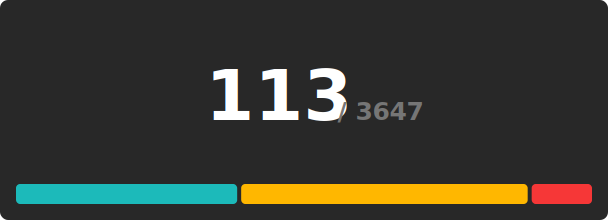
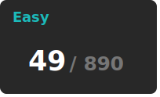
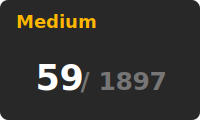
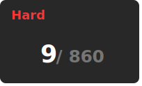

# Leetcode Tracker
  
🚀 Solving problems daily to stay sharp in Problem-Solving, Data Structures, Algorithms, and System Thinking

## Problems Stats

  

## Skills

                                     

---

## Problem Series  

📌 Grouping related problems together helps track progress & build intuition.  

-   
- 
-   

---

⭐ Star this repo if you're on a similar journey!

**Pritam Kininge**
[LinkedIn](https://linkedin.com/in/pritam-kininge)  |  [GitHub](https://github.com/kininge)  |  [Leetcode](https://leetcode.com/u/kininge007/)
