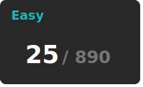

# Leetcode Tracker
  
🚀 Solving problems daily to stay sharp in Problem-Solving, Data Structures, Algorithms, and System Thinking

## Problems Stats

  

## Skills 

---

## Problem Series  

📌 Grouping related problems together helps track progress & build intuition.  

# 🔴 Hard Problems

Click a problem to view your notes & solution.

- 
### 🔲 Rectangles & Squares in Matrix  
- [85. Maximal Rectangle](./medium/85-maximal-rectangle.md)  
- [221. Maximal Square](./medium/221-maximal-square.md)  
- [1277. Count Square Submatrices with All Ones](./medium/1277-count-square-submatrices-with-all-ones.md)  
- [1504. Count Submatrices with All Ones](./medium/1504-count-submatrices-with-all-ones.md)  

### ➗ Subarray & Zero Splits  
- [2348. Number of Zero-Filled Subarrays](./medium/2348-number-of-zero-filled-subarrays.md)  
- [53. Maximum Subarray](./easy/53-maximum-subarray.md)  
- [152. Maximum Product Subarray](./medium/152-maximum-product-subarray.md)  

### 🧩 Sliding Window & Prefix Sum  
- [560. Subarray Sum Equals K](./medium/560-subarray-sum-equals-k.md)  
- [209. Minimum Size Subarray Sum](./medium/209-minimum-size-subarray-sum.md)  
- [238. Product of Array Except Self](./medium/238-product-of-array-except-self.md)  

---

⭐ Star this repo if you're on a similar journey!

**Pritam Kininge**    
[LinkedIn](https://linkedin.com/in/pritam-kininge)  |  [GitHub](https://github.com/kininge)  |  [Leetcode](https://leetcode.com/u/kininge007/)

